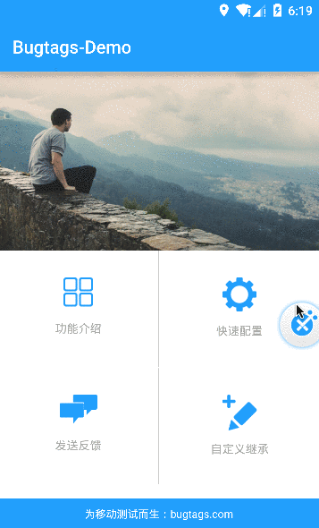

Bugtags Android SDK
===================
###帮助QQ群: 479166560

[Bugtags]，为移动测试而生，随时随地改善你的移动应用。只需一步，提交bug及其上下文数据，自动捕捉崩溃，让修复bug更简单。

[免费注册](http://bugtags.com/)，邀请你的团队成员来一起来改善你的app。

下载demo app: [DEMO.apk](screenshot/demo.apk)

> 如果你使用Eclipse来开发Android App, 访问: [SDK for Eclipse]下载SDK.

# 功能
1. 一键截屏，使用标签进行bug描述.
2. 自动获取设备与app环境参数
3. 自动捕捉闪退bug
4. bug生命周期管理

# 使用gradle安装集成

## 第一步：
* 在项目的build.gradle（项目最外层的build.gradle文件，所谓的Top-level build file）设置repositories：
```gradle
buildscript {
    repositories {
        jcenter()
    }
    dependencies {
        classpath 'com.android.tools.build:gradle:1.2.3'
    }
}
allprojects {
    repositories {
        jcenter() //注：repository 1
        mavenCentral()  //注：repository 2
    }
}
```
* 在模块的build.gradle添加依赖：
```gradle
dependencies {
    compile 'com.bugtags.library:bugtags-lib:latest.integration'
}
```

## 第二步：
* 在你的Activity基类中添加3个回调：
```java
    package your.package.name;

    import android.app.Activity;
    import android.os.Bundle;
    import android.view.MotionEvent;

    import com.bugtags.library.Bugtags;

    public class CustomActivity extends Activity{
        @Override
        protected void onResume() {
            super.onResume();
            //注：回调 1
            Bugtags.onResume(this);
        }

        @Override
        protected void onPause() {
            super.onPause();
              //注：回调 2
            Bugtags.onPause(this);
        }

        @Override
        public boolean dispatchTouchEvent(MotionEvent event) {
              //注：回调 3
            Bugtags.onDispatchTouchEvent(this, event);
            return super.dispatchTouchEvent(event);
        }
    }
```

## 第三步：
* 继承Application，在onCreate() 方法中初始化Bugtags：
```java
public class MyApplication extends Application {

    @Override
    public void onCreate() {
        super.onCreate();
        //在这里初始化
        Bugtags.start("YOUR APPKEY", this, Bugtags.BTGInvocationEventBubble);
    }
}
```
* 修改AndroidManifest.xml，使用MyApplication类,例如：
```xml
<application
    android:name=".MyApplication"
    android:label="@string/app_name"
    android:theme="@style/AppTheme" >
    ....
</application>
```

关于如何使用Android Studio以及gradle，请参考：[Android Developer Site].

# 使用截屏


# 高级选项
1. 呼出方式Invoke event:
  * BTGInvocationEventBubble: 通过悬浮小球呼出Bugtags。
  * BTGInvocationEventShake: 通过摇一摇呼出Bugtags。
  * BTGInvocationEventNone: 不显示悬浮小球，只收集崩溃信息（如果允许）。
2. 手动发送Exception:
  * Bugtags.sendException(Throwable ex);
3. 发送文字反馈信息:
  * Bugtags.sendFeedback(String msg);

# License
This demo is [BSD-licensed](LICENSE).

[SDK for Eclipse]:https://github.com/bugtags/Bugtags-Android-Eclipse
[Bugtags]:http://bugtags.com
[Android Developer Site]:http://developer.android.com/tools/studio/index.html
